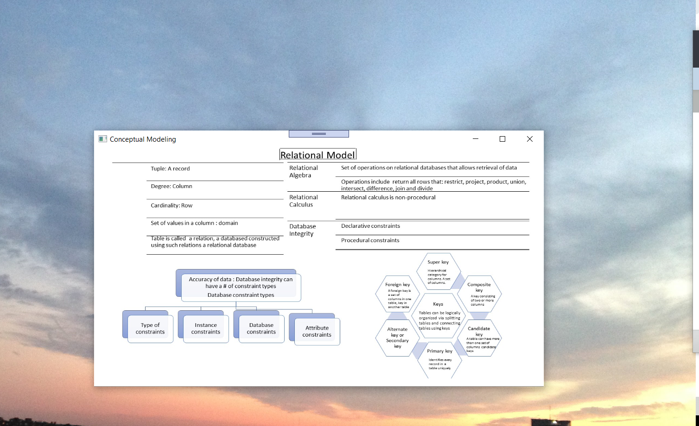
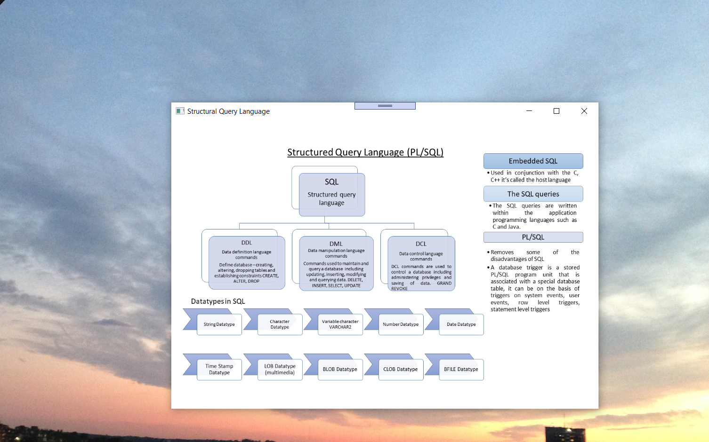
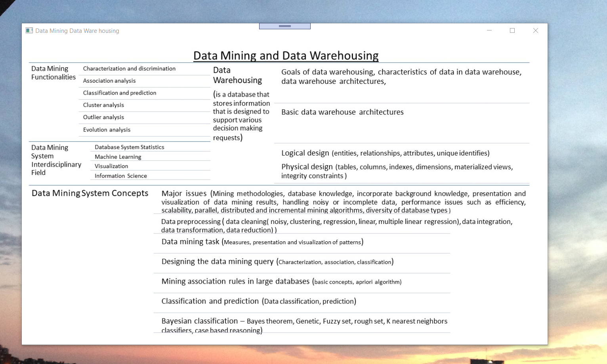
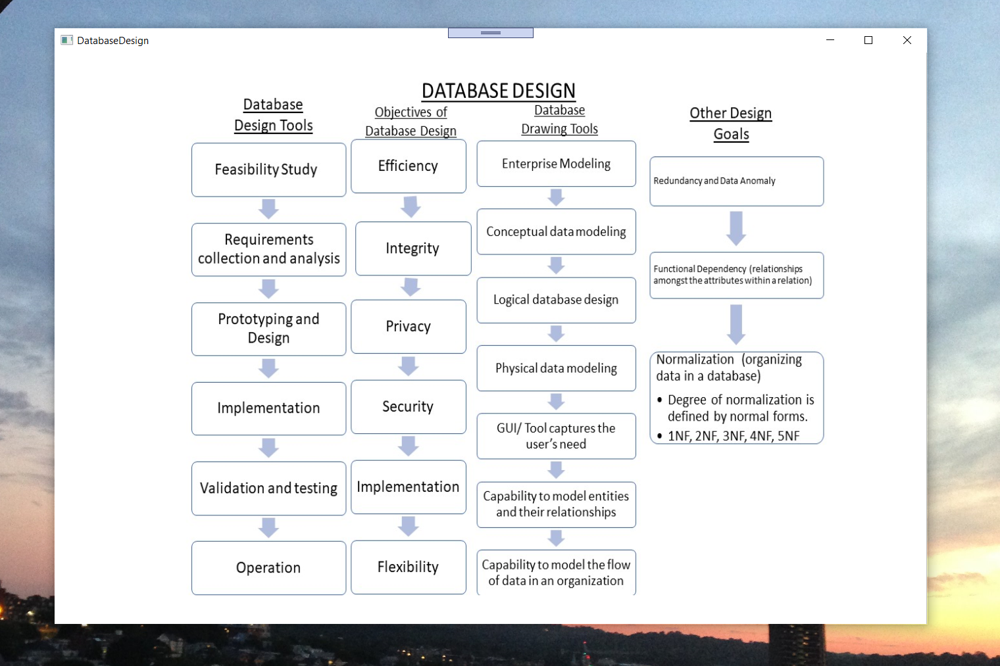
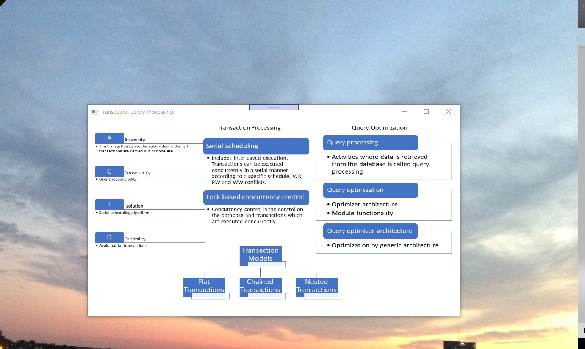
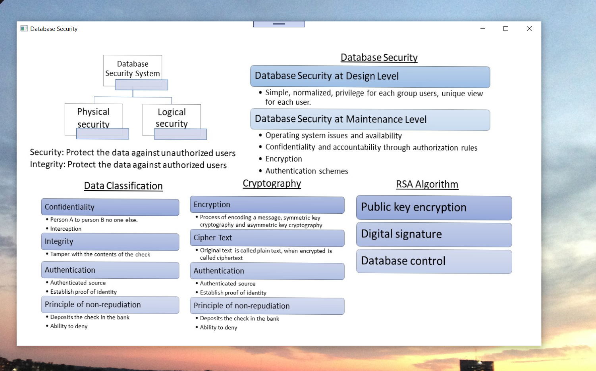
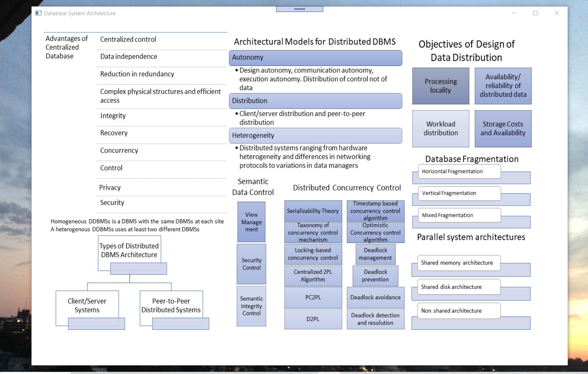
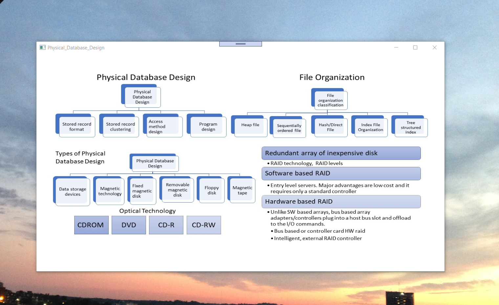
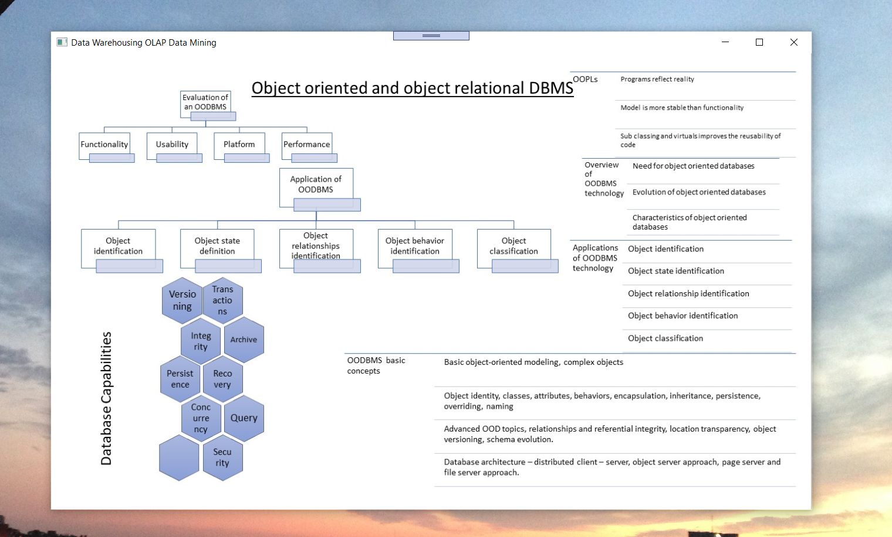
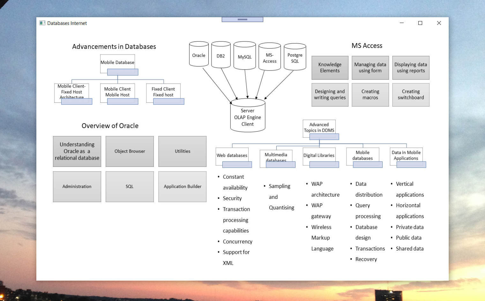

# Database Management Design

The project provides an introduction to applications and design of databases

All images are custom by Alpa D. Desai or have references.

Confidential information is not displayed.

Please download the executable in https://github.com/alpaddesai/DatabaseManagementDesign/releases for details.

## Database Management System

## Data Modeling

## Conceptual Modeling and Relational Model

## Structural Query Language

## Data mining and Data warehouse

## Database Design

## Transaction and Query Processing

## Database Security

## Dabase System Architecture

## Information retrieval

## Object technology DBMS

## Databases and internet

